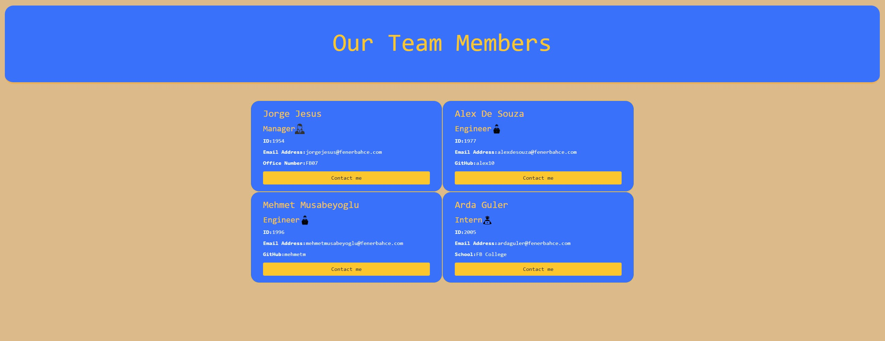

# Team Profile Generator

## Table of Contents
* [Description](#description)
* [Usage](#usage)
* [Usage Demonstration Link](#usage-demonstration-link)
* [Test Demonstration Link](#test-demonstration-link)
* [User Story](#user-story)
* [Screenshots](#screenshots)
* [Code Snippet](#code-snippet)
* [Technologies Used](#technologies-used)
* [Credits](#credits)
* [Author Links](#author-links)


## Description

Team Profile Generator is a node.js application that runs on the console and takes in information about employees on a software engineering team, then generates a "index.html" file for the user based on the console inputs they provide. The application demo video has been uploaded to the drive folder at [Google Drive](https://drive.google.com/file/d/1SMpOEvAnya3oiG9Z45fbLPggAopqbbNz/view)


## Usage

User starts the application by running "node index.js" in their console. Once the application starts, the user is prompted with a set of questions about the team they would like to create a profile for. Questions prompted by the application includes employee informations such as name, id, email, and role. When user provides their answers using console input, "index.html" file is generated with specific info cards for each employee entered. 


## Usage Demonstration Link

Link to the video that demonstrates the usage of this application can be found at [here](https://drive.google.com/file/d/1SMpOEvAnya3oiG9Z45fbLPggAopqbbNz/view)

## Test Demonstration Link

Video demonstrating tests for the employee classes can be found [here](https://drive.google.com/file/d/1LiabuPIqF_G5dOah0HdTJkR98qaNEkXQ/view)

## User Story

| As a       | I want to                                             | So that   
| ---------- | ----------------------------------------------------- | --------------------------------------------------------- |
| `Manager`  | generate a webpage that displays my team's basic info | `I have quick access to their emails and GitHub profiles` |


## Screenshots

### *1. Executing program*


### *2. Team webpage generated by using console*




## Code Snippet

### The generate Html function:
#### Generates index.html based on ourTeam array which includes provided answers from user. 
```

async function generateHtml(){

    let html = `
    <!DOCTYPE html>
    <html lang="en">
    <head>
      // HTML redacted for conciseness
    </head>
    <body class="w-auto p-3">
        <header class="jumbotron bg-primary text-light">
            <h1 class="display-3 text-warning">Our Team Members</h1>
        </header>
    
        <div class="container d-flex flex-wrap rounded-lg p-3">
    `
    for(let i=0; i<ourTeam.length; i++){

        html = html + appendEmployee(ourTeam[i]);
    }

    html = html + `
    </div>
    </body>
    <script src="../index.js"></script>
    </html>
    `
    fs.writeFile("dist/index.html", html, (err) =>
    err ? console.log(err) : console.log('Successfully created new index.html')
);

}


```

### The inquirer function:
#### Prompts user to answer questions and pushes answers to ourTeam array.
```

async function inquirerChain() {
    await inquirer
        .prompt(managerQuestions)
        .then((userInputs) => {
            ourTeam.push(new Manager(userInputs.managerName, userInputs.managerId, userInputs.managerEmail, userInputs.managerOffice, "Manager"));
        });

    let inquirerEnd = false;
    let chosenEmployeeType;

    while (!inquirerEnd) {
        await inquirer
            .prompt(nextEmployeeQuestion)
            .then((userInputs) => {
                chosenEmployeeType = userInputs.employeeType;
            });


        if (chosenEmployeeType === "Engineer") {
            await inquirer
                .prompt(engineerQuestions)
                .then((userInputs) => {
                    ourTeam.push(new Engineer(userInputs.engineerName, userInputs.engineerId, userInputs.engineerEmail, userInputs.engineerGithub, "Engineer"));
                });
        }
        else if (chosenEmployeeType === "Intern") {
            await inquirer
                .prompt(internQuestions)
                .then((userInputs) => {
                    ourTeam.push(new Intern(userInputs.internName, userInputs.internId, userInputs.internEmail, userInputs.internSchool, "Intern"));
                });
        }
        else {
            inquirerEnd = true;
            console.log(ourTeam);
        }

    }

}

```

## Technologies Used

- JavaScript
- HTML
- CSS
- Node.js
- Bootstrap
- Npm Inquirer
- Npm Jest 
- Screencastify


## Credits
[Npm Inquirer Documentation](https://www.npmjs.com/package/inquirer/v/8.2.4#methods)

[Npm Jest Documentation](https://jestjs.io/docs/getting-started)

[Bootstrap Documentation](https://getbootstrap.com/docs/5.2/getting-started/introduction/)


## Author Links

[LinkedIn Profile](https://www.linkedin.com/in/mehmet-musabeyoglu)

[GitHub Profile](https://github.com/MehmetMusabeyoglu)

[E-mail Address](mailto:mehmetmusabeyoglu@gmail.com) 

 ## License 
 This project is licensed under the MIT License 
 <br>
 [](https://opensource.org/licenses/MIT)
